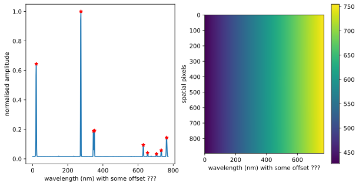

# Open Source DIY Hyperspectral Imager Library
> Library to calibrate, trigger and capture data cubes for the open source DIY hyperspectral camera. 


<a rel="license" href="http://creativecommons.org/licenses/by/3.0/au/"></a><br />This work is licensed under a <a rel="license" href="http://creativecommons.org/licenses/by/3.0/au/">Creative Commons Attribution 3.0 Australia License</a>.

Documentation can be found here: [https://openhsi.github.io/openhsi/](https://openhsi.github.io/openhsi/).

## Install

`pip install openhsi`

## Requirements

- Python 3.6+
- Ximea SDK (See https://www.ximea.com/support/wiki/apis/Python)

## Development and Contributions

This whole software library, testing suite, documentation website, and PyPi uploader was developed in Jupyter Notebooks using [`nbdev`](https://www.fast.ai/2019/12/02/nbdev/). 


## How to use

### Taking a single picture

```python
from openhsi.capture import *

try:
    take_show()
except:
    print('No devices found. Camera not connected.')
```

    No devices found. Camera not connected.


### Changing the Exposure and Gain

```python
try:
    with OpenHSI(xbinwidth=896,xbinoffset=528,exposure_ms=1000,gain=0) as cam:
        cam.exposure    = 100
        cam.gain        = 5

        img = cam.start().get_img()
        plt.imshow(img)
        plt.xlabel('Wavelength (nm)')
        plt.ylabel('Line pixels')
        plt.show()
except:
    print('No devices found. Camera not connected.')
```

    No devices found. Camera not connected.


### Calibration

```python
from openhsi.calibrate import *
result = fit_arc_lines2(arc_file = "cal_files/arc.hdf5", wave_save_file = None, skip = 1, show = True)
```

    Fit arc lines for each spatial pixel


<div>
    <style>
        /* Turns off some styling */
        progress {
            /* gets rid of default border in Firefox and Opera. */
            border: none;
            /* Needs to be in here for Safari polyfill so background images work as expected. */
            background-size: auto;
        }
        .progress-bar-interrupted, .progress-bar-interrupted::-webkit-progress-bar {
            background: #F44336;
        }
    </style>
  <progress value='0' class='' max='896' style='width:300px; height:20px; vertical-align: middle;'></progress>

</div>




