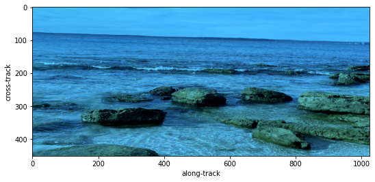

# Open Source DIY Hyperspectral Imager Library
> Library to calibrate, trigger and capture data cubes for the open source DIY hyperspectral camera. 


This Python library is licensed under the [Apache v2 License](https://www.apache.org/licenses/LICENSE-2.0). The documentation is licensed under a <a rel="license" href="http://creativecommons.org/licenses/by/3.0/au/">Creative Commons Attribution 3.0 Australia License</a>.

Documentation can be found here: [https://openhsi.github.io/openhsi/](https://openhsi.github.io/openhsi/).

## Install

`pip install openhsi`

## Requirements

- Python 3.6+
- Ximea SDK (See https://www.ximea.com/support/wiki/apis/Python)

## Development and Contributions

This whole software library, testing suite, documentation website, and PyPI package was developed in Jupyter Notebooks using [nbdev](https://nbdev.fast.ai/). 


## How to use

### Taking a single hyperspectral datacube

The example shown here uses a simulated camera for testing purposes. Replace `SimulatedCamera` with the appropriate Python class for your own camera to work with real hardware. 

```python
from openhsi.capture import *

with SimulatedCamera(img_path="assets/rocky_beach.png", n_lines=1024, processing_lvl = 3) as cam:
    cam.collect()
    fig = cam.show(plot_lib="matplotlib",robust=True)


```

    100%|██████████| 1024/1024 [00:18<00:00, 55.21it/s]


    Text(0, 0.5, 'cross-track')




